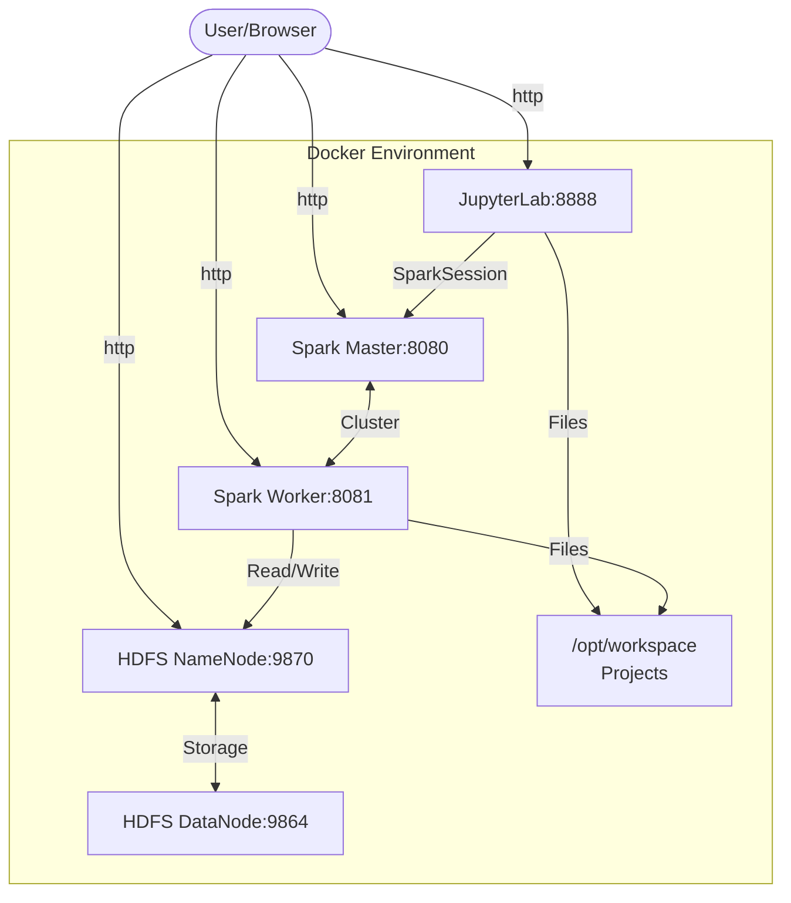

# Spark Practice Environment

A lightweight Spark environment for local practice with HDFS and JupyterLab.

## Architecture



## Features

- Apache Spark 3.3.1 with master and worker nodes
- Lightweight HDFS setup (NameNode and DataNode)
- JupyterLab with persistent settings
- Bash terminal with Git support
- Projects directory for your Spark exercises
- Python 3.9 environment (for compatibility with PySpark 3.3.1)

## Getting Started

### Prerequisites
- Docker
- Docker Compose

### Setup

1. Clone the repository:
```bash
git clone https://github.com/your-username/spark-practice.git
```

2. Navigate to the repository directory:
```bash
cd spark-practice
```

3. Build the Docker images:
```bash
chmod +x build.sh
./build.sh
```

4. Start the services:
```bash
docker-compose up -d
```

5. Access the services:
   - JupyterLab: http://localhost:8888
   - Spark Master UI: http://localhost:8080
   - Spark Worker UI: http://localhost:8081
   - HDFS NameNode UI: http://localhost:9870

### Directories

- `/opt/workspace` - Root workspace in the container
- `/opt/workspace/projects` - Mounted from local `./projects` directory, where you should put your practice files

### Persistence

The following data is persisted:
- Jupyter settings (including themes, extensions, etc.)
- HDFS data
- Spark workspace

## Usage

### Python Compatibility Note

This environment uses Python 3.9 to ensure compatibility with PySpark 3.3.1. If you encounter any serialization errors like the following, it's likely a Python version compatibility issue:

```
_pickle.PicklingError: Could not serialize object: IndexError: tuple index out of range
```

The Dockerfiles are configured to install compatible versions, but if you're running code outside this environment, make sure to use Python 3.9 or 3.10 for best compatibility with PySpark 3.3.1.

### Working with Jupyter

Create notebooks in the `/projects` directory to preserve them between container restarts.

### Connecting to Spark

In your Jupyter notebooks, you can connect to Spark with:

```python
from pyspark.sql import SparkSession

spark = SparkSession.builder \
    .appName("PracticeApp") \
    .master("spark://spark-master:7077") \
    .getOrCreate()

# Test with a simple operation
df = spark.createDataFrame([(1, "hello"), (2, "world")], ["id", "text"])
df.show()
```

### Working with HDFS

You can interact with HDFS using:

```bash
# List files
hdfs dfs -ls /

# Create a directory
hdfs dfs -mkdir -p /user/practice/data

# Upload a file
hdfs dfs -put localfile.txt /user/practice/data/

# Read a file
hdfs dfs -cat /user/practice/data/localfile.txt
```

## Shutting Down

```bash
docker-compose down
```

To completely clean up (including volumes):
```bash
docker-compose down -v
```